# ZEMO ATM 🏧

> a 2021 C# WinForms banking simulator that kept growing: deposits, withdrawals, transfers, bill payments, printable receipts, email alerts and an admin console.

ZEMO ATM is an old **Windows Forms + SQL Server** project built while I was learning how stateful desktop applications, database writes and multi-screen workflows fit together.

It is **not real banking software** and should not be treated as one. The useful part of keeping it public is the engineering story: a small ATM exercise gradually turned into a fairly large transaction-oriented desktop app, complete with all the architectural lessons that come with that.

## screenshots

These are the original screenshots from the project-era portfolio archive, now stored with this public repository.

<p align="center">
  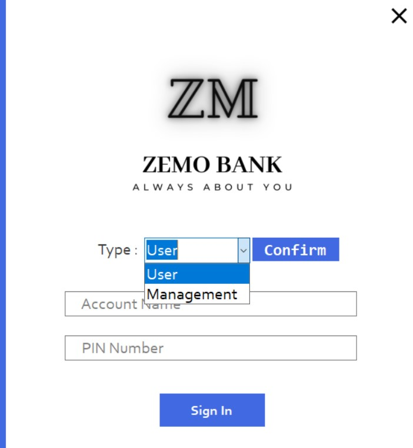
  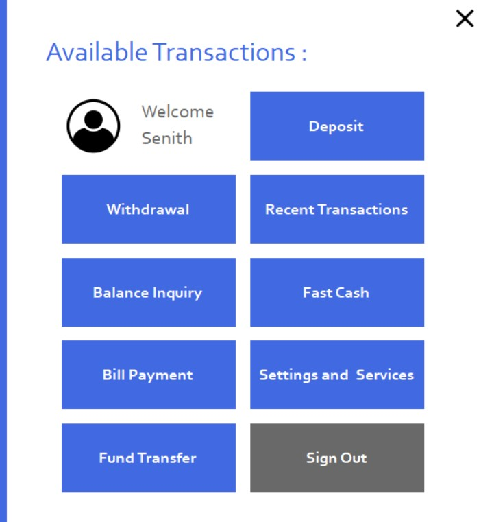
</p>
<p align="center">
  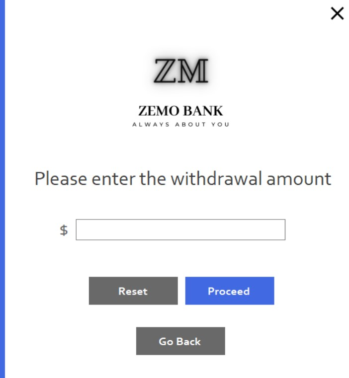
  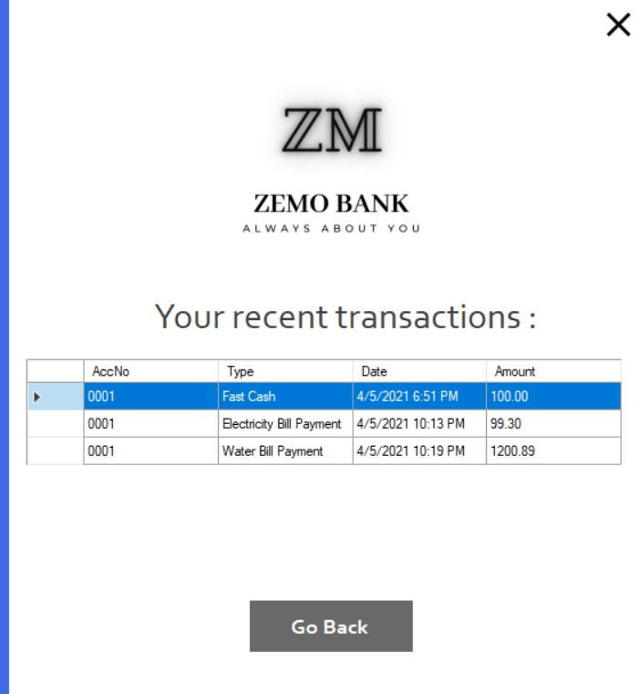
</p>
<p align="center">
  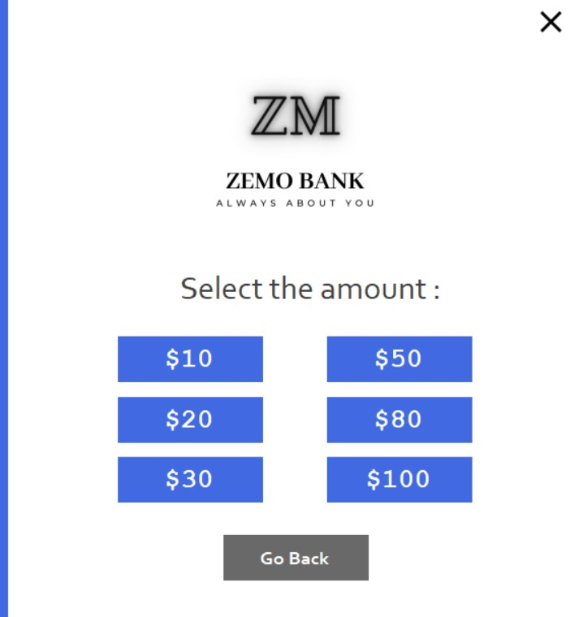
  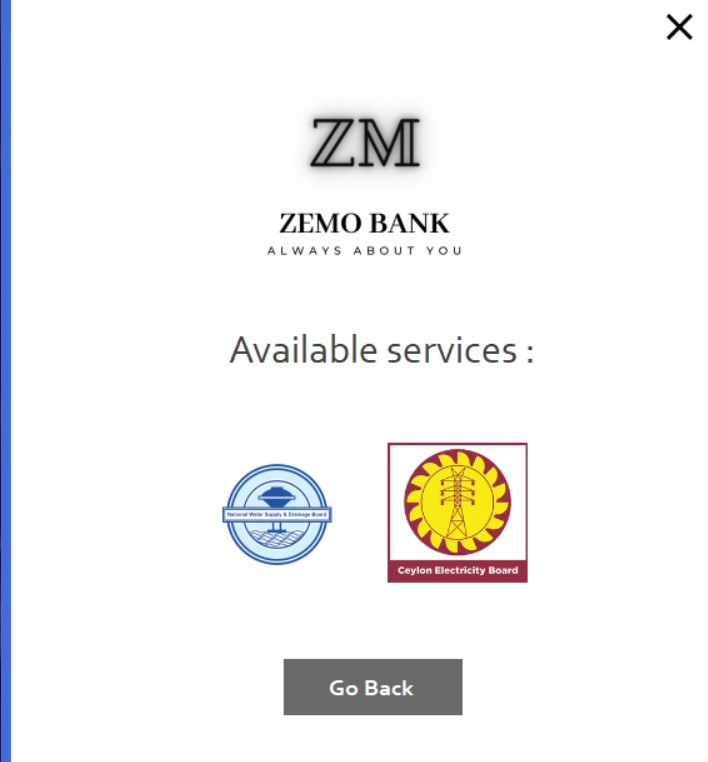
</p>

<details>
<summary>more screens</summary>

<p align="center">
  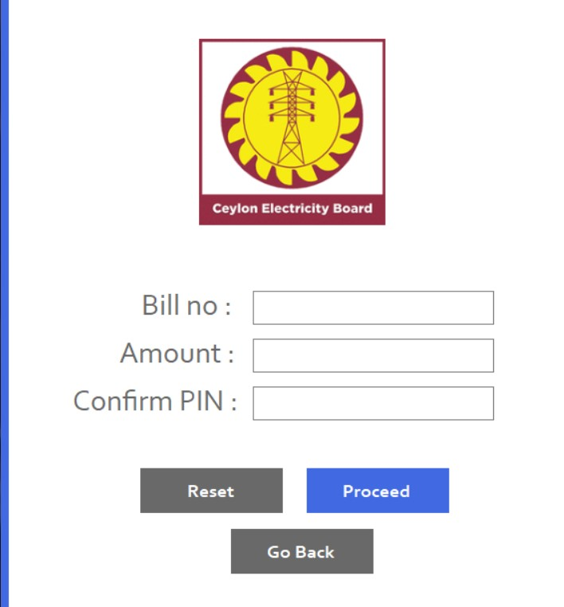
  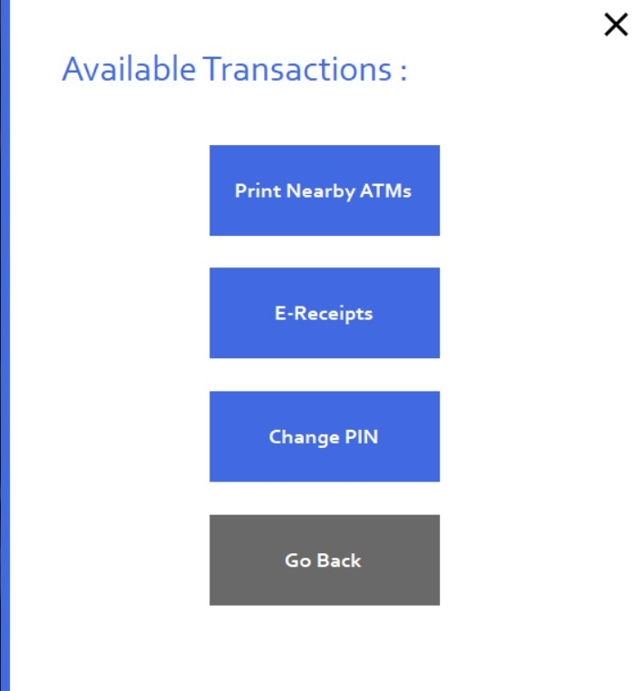
</p>
<p align="center">
  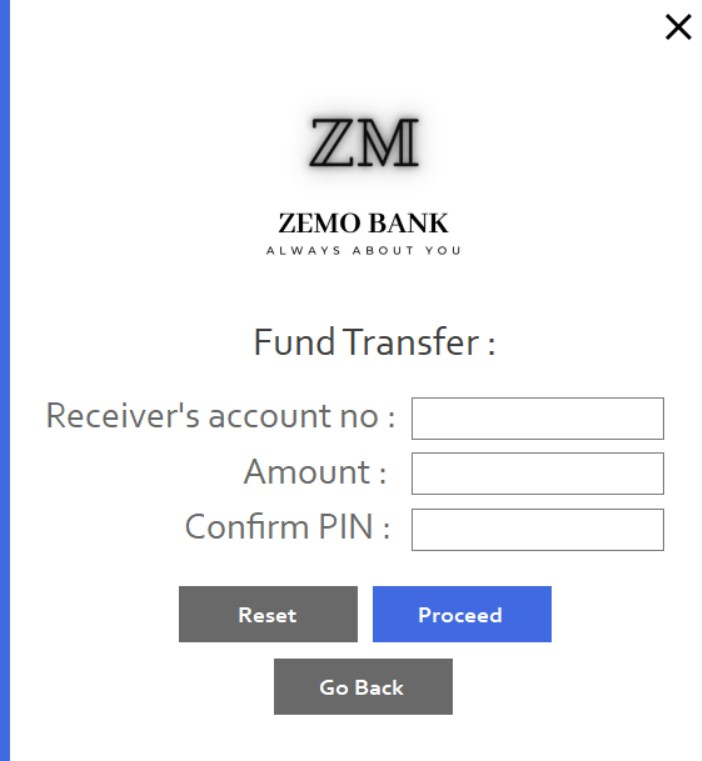
  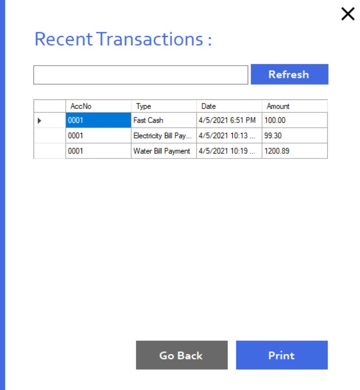
</p>
<p align="center">
  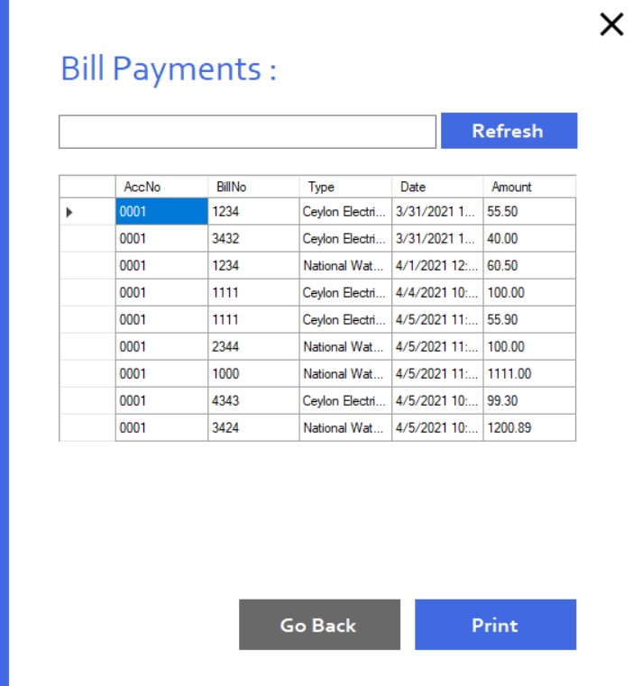
  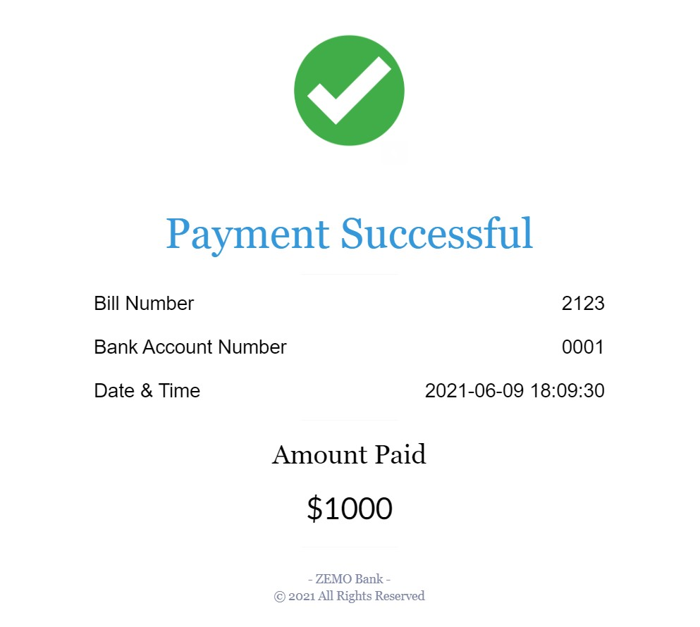
</p>
<p align="center">
  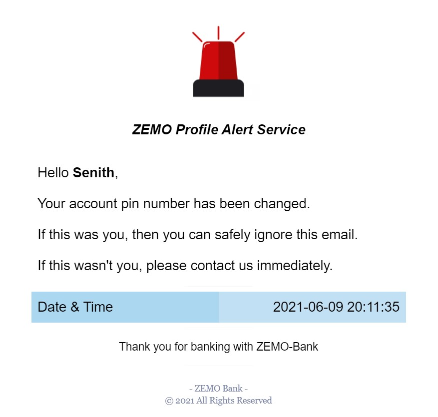
  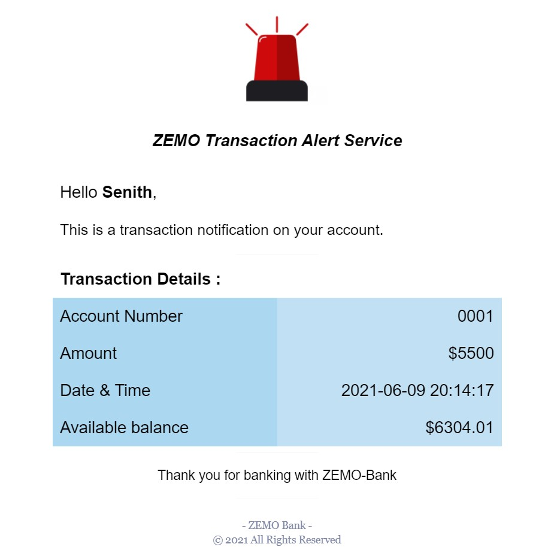
</p>

</details>

## what it does

There are two broad sides to the application.

### customer side

A signed-in customer can:

- view the current account balance
- deposit money
- withdraw money
- use fixed-value fast-cash buttons
- transfer money to another simulated account
- browse recent transactions
- pay electricity bills
- pay water bills
- print payment receipts
- optionally receive email receipts
- enable/disable the historical e-receipt preference
- browse the bundled nearby-ATM directory
- change the account PIN
- receive a simulated security alert for large withdrawals

### management side

The separate management login opens an admin console for browsing and printing:

- account metadata
- recent transactions
- fund transfers
- bill payments
- e-receipt preferences
- security alerts
- nearby ATM records

The cleaned account view deliberately does **not** expose stored PIN/password values.

## the interesting part: money movement

The original project changed balances and then wrote history records as separate SQL operations.

That is a dangerous shape for anything pretending to model financial state:

```text
debit balance        ✓
write transaction    ✗

=> balance changed with no matching history
```

The current core flows move those related writes into SQL transactions.

### deposit

```text
begin transaction
      │
      ├── balance += amount
      ├── insert RecentT
      └── read resulting balance
      │
   commit
```

### withdrawal / fast cash

```text
begin serializable transaction
      │
      ├── UPDATE ... WHERE Balance >= amount
      ├── insert RecentT
      └── read resulting balance
      │
   commit
```

The guarded update means the debit itself checks the available balance instead of trusting an earlier read.

### fund transfer

This flow had the most important correctness bug in the original code.

Historically the sender was debited and the transfer was logged, but the recipient balance was never credited.

The current flow is:

```text
begin serializable transaction
      │
      ├── verify recipient exists
      ├── debit sender if funds are available
      ├── credit recipient
      ├── log sender transaction
      ├── log recipient transaction
      └── insert FundTransfer record
      │
   commit
```

All of it succeeds together or rolls back together.

### bill payment

Electricity and water payments now also group the balance debit, recent-transaction entry and bill-payment record in one transaction.

Email/printing happens **after** the database transaction. A mail failure does not undo a successful local payment or leave its accounting half-written.

## architecture after the cleanup

The project is still recognizably the old WinForms application, but the most sensitive shared behavior now has explicit boundaries.

```text
WinForms screens
      │
      ├── BankingService
      │      ├── balances
      │      ├── deposits
      │      ├── withdrawals
      │      ├── transfers
      │      ├── bill payments
      │      └── e-receipt state
      │
      ├── GridData
      │      └── admin / lookup queries
      │
      ├── EmailService
      │      └── optional SMTP + local HTML templates
      │
      └── CredentialHasher
             └── PBKDF2-SHA256
      │
      ▼
Database
      │
      ▼
SQL Server / LocalDB
```

That is still far from how I would build a real banking system, but it removes a lot of duplicated database plumbing from button handlers and makes the important transaction boundaries visible.

## authentication cleanup

The old version compared customer PINs and management passwords directly against plaintext database values.

Current sign-in does this instead:

```text
account name
    │
    ▼
parameterized lookup
    │
    ▼
stored credential
    │
    ├── PBKDF2 value → verify hash
    │
    └── old local plaintext value
            │
            ├── compare once
            └── successful login → replace with PBKDF2 hash
```

The compatibility branch is only there so an old **development** database can migrate after first login.

This is still not a production authentication design. A real banking product would not make a desktop client responsible for credential verification against a directly reachable database.

## database + SQL cleanup

Database access now goes through one helper and can be configured with:

```text
ZEMO_DB_CONNECTION_STRING
```

Without it, the project uses a local development database named `ZEMO_Bank`.

Queries touched by the overhaul use SQL parameters instead of concatenating user-controlled input into SQL strings.

The replacement `Database.sql` also fixes the historical schema problems:

- foreign keys point to the correct account table
- money tables have stable primary keys
- balances cannot be negative
- transfer senders and recipients are both account foreign keys
- self-transfers are rejected
- transaction-heavy tables have account/date indexes
- credential columns can hold hashes
- the admin account grid no longer needs to select credential fields
- the script contains only obvious disposable demo data

## receipts + email alerts

The old code embedded SMTP configuration directly in the desktop source and loaded templates from a developer-specific absolute Windows path.

That has been removed.

Email is now optional and configured at runtime:

```text
ZEMO_SMTP_HOST
ZEMO_SMTP_PORT
ZEMO_SMTP_USERNAME
ZEMO_SMTP_PASSWORD
ZEMO_SMTP_FROM
```

Templates are loaded relative to the application directory:

```text
index.html
TransactionAlert.html
ProfileAlert.html
```

If SMTP is not configured, the banking simulation still works.

For bill payments, the app falls back to the original printable DataGridView receipt flow when an email receipt cannot be sent.

## historical e-receipt rule

One of the more specific product ideas in the original app was an e-receipt preference.

After enabling it, the UI intentionally prevented disabling it for 30 days.

That behavior is preserved because it is part of the original project rather than something I would invent in a cleanup.

The current code just moves the preference reads/writes out of raw button-handler SQL.

## large-withdrawal alert

Withdrawals above the historical threshold create a `SecurityAlerts` record.

If SMTP is configured, the app also attempts to send the account email address an alert using the bundled transaction template.

The actual money movement does not depend on email delivery succeeding.

## stack

| Area | Technology |
| --- | --- |
| UI | C# Windows Forms |
| Runtime | .NET Framework 4.7.2 |
| Database | SQL Server / LocalDB |
| Data access | `System.Data.SqlClient` |
| Password/PIN storage | PBKDF2-SHA256 |
| Receipts | DataGridView + DGVPrinter |
| Optional mail | `System.Net.Mail` |
| Dependencies | NuGet / `packages.config` |
| Build | Visual Studio / MSBuild |

## project structure

```text
atm-system/
├── ATM.sln
├── Database.sql
├── ATM/
│   ├── Infrastructure/
│   │   ├── Database.cs
│   │   └── GridData.cs
│   ├── Security/
│   │   └── CredentialHasher.cs
│   ├── Services/
│   │   ├── BankingService.cs
│   │   └── EmailService.cs
│   ├── SignIn.cs
│   ├── Dash.cs
│   ├── Deposit.cs
│   ├── Withdrawal.cs
│   ├── FastCash.cs
│   ├── FundTransfer.cs
│   ├── BillPayment.cs
│   ├── electricity.cs
│   ├── water.cs
│   ├── Settings.cs
│   ├── ChangePIN.cs
│   ├── NearbyATM.cs
│   ├── Admin*.cs
│   ├── index.html
│   ├── TransactionAlert.html
│   └── ProfileAlert.html
└── docs/
    ├── engineering.md
    └── screenshots/
```

The `.Designer.cs` and `.resx` files are intentionally part of the repository. They are the actual WinForms layout/resources, not build output.

## running it

This is a Windows / .NET Framework project.

1. Install Visual Studio with **.NET desktop development** and .NET Framework 4.7.2 targeting support.
2. Restore NuGet packages for `ATM.sln`.
3. Run `Database.sql` against SQL Server or LocalDB.
4. Set `ZEMO_DB_CONNECTION_STRING` if the default LocalDB setup is not suitable.
5. Open `ATM.sln` and build/run the project.

Example PowerShell configuration:

```powershell
$env:ZEMO_DB_CONNECTION_STRING = "Data Source=(LocalDB)\MSSQLLocalDB;Initial Catalog=ZEMO_Bank;Integrated Security=True"
```

Optional SMTP setup:

```powershell
$env:ZEMO_SMTP_HOST = "smtp.example.com"
$env:ZEMO_SMTP_PORT = "587"
$env:ZEMO_SMTP_USERNAME = "demo-user"
$env:ZEMO_SMTP_PASSWORD = "demo-password"
$env:ZEMO_SMTP_FROM = "demo@example.com"
```

The development SQL script includes obvious disposable demo accounts. Their old-style local credentials are intentionally migrated to PBKDF2 by the current login path after a successful first sign-in.

## what this still is not

The cleanup makes the repository safer to publish and easier to reason about. It does **not** turn the application into production banking infrastructure.

A real financial product would need, among other things:

- a trusted server-side API instead of a desktop client talking directly to SQL Server
- strong identity, MFA and session controls
- an immutable double-entry ledger rather than a mutable balance column as the primary source of truth
- idempotency for financial commands
- authorization at every server boundary
- audit/event retention
- encrypted secret management
- rate limiting and fraud controls
- deliberate money/currency types and rounding rules
- robust concurrency tests
- observability and recovery workflows
- compliance and security review far beyond a coursework project

## what I would build differently now

The biggest change would be moving all trust off the desktop client.

```text
desktop / web / mobile client
          │
          ▼
authenticated backend API
          │
          ├── Accounts
          ├── Transfers
          ├── Payments
          ├── Receipt delivery
          └── Admin authorization
          │
          ▼
ledger + account read models
          │
          ▼
SQL / event storage
```

The UI would submit commands like “transfer 25.00 from A to B”; it would never receive database credentials or directly mutate balances.

I would also model money and transaction identifiers explicitly, make retries idempotent, use one signed-in-session abstraction instead of static fields, put email behind the server, and test all balance-changing operations independently from the WinForms UI.

There is a deeper breakdown in [docs/engineering.md](docs/engineering.md).

## why keep this repo?

Because it shows a very different part of the journey from the mobile apps I build now.

It is messy in the useful way old projects are messy: lots of screens, lots of state, a database behind everything, several things I would never design the same way twice — and enough real behavior that revisiting it years later exposed interesting transaction, security and architecture problems worth fixing.

---

a 2021 desktop side quest; definitely not your bank.
